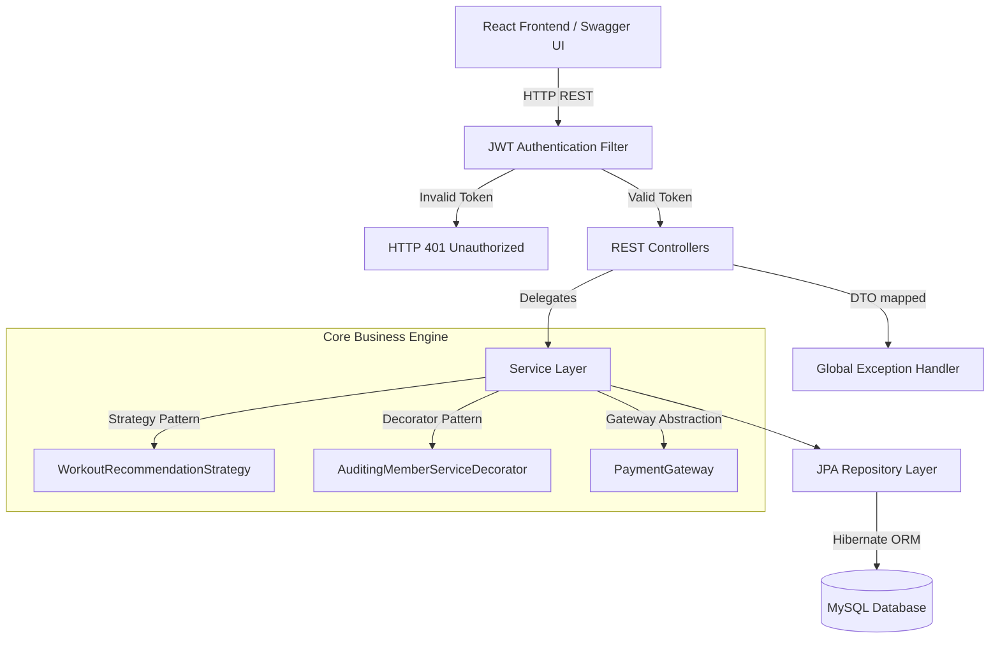

# 🏋️ Gym Management System — OOAD Mini-Project

A full-stack, role-based Gym Management System built with **Spring Boot 3.5** (Backend) and **React + Vite** (Frontend). Engineered strictly using Object-Oriented Analysis and Design (OOAD) principles, GoF Design Patterns, and UML-driven architecture.

---

## Table of Contents
- [Problem Statement](#problem-statement)
- [Key Features](#key-features)
- [Technology Stack](#technology-stack)
- [Project Structure](#project-structure)
- [Architecture](#architecture)
- [Design Patterns](#design-patterns)
- [Design Principles (SOLID)](#design-principles-solid)
- [UML Diagrams](#uml-diagrams)
- [Domain Model](#domain-model)
- [REST API Reference](#rest-api-reference)
- [Demo Data & Credentials](#demo-data--credentials)
- [Setup and Run Guide](#setup-and-run-guide)
- [Individual Contributions](#individual-contributions)

---

## Problem Statement
Traditional gym management systems rely on disjointed, manual processes for handling memberships, assigning trainers, and tracking client progress, leading to administrative overhead and poor member retention. This project delivers a centralized, automated platform that integrates role-based access control, intelligent workout plan assignment, membership lifecycle tracking, and payment processing — while remaining strictly modular and extensible.

---

## Key Features
- **Role-Based Access Control:** Secure, isolated workflows for Admins, Trainers, and Members via JWT authentication.
- **Automated Membership Lifecycles:** End-to-end tracking of membership creation, payment handling, expiration, and attendance validation.
- **Dynamic Workout Assignments:** Pipeline allowing Trainers to create, assign, and monitor structured workout plans and exercises.
- **Algorithmic Recommendations:** Automated workout recommendations generated from member BMI data using the Strategy pattern.
- **Admin Dashboard:** Real-time reporting on total members, trainers, revenue, and daily attendance.
- **Auto-Seeded Demo Data:** Application ships with a `DemoDataSeeder` that populates realistic data on first boot.

---

## Technology Stack

| Layer | Technology |
|---|---|
| **Backend** | Java 21, Spring Boot 3.5.13 |
| **Security** | Spring Security, JWT (jjwt 0.12.6) |
| **Database** | MySQL 8+, Spring Data JPA, Hibernate ORM |
| **Frontend** | React 18, Vite 8, React Router |
| **API Docs** | SpringDoc OpenAPI 3 / Swagger UI |
| **Build** | Maven (mvnw wrapper included) |

---

## Project Structure

```text
GYM-MANAGEMENT-SYSTEM/
├── UML DIAGRAMS/
│   ├── USE CASE DIAGRAM/       (1 Use Case Diagram)
│   ├── CLASS DIAGRAM/          (1 Class Diagram)
│   ├── STATE DIAGRAM/          (4 State Diagrams)
│   └── ACTIVITY DIAGRAM/       (4 Activity Diagrams)
├── gym-management-system-backend/
│   └── src/main/java/com/gym/
│       ├── config/              # AdminSeeder, DemoDataSeeder, SecurityConfig
│       ├── controller/          # 13 REST Controllers
│       ├── dto/                 # Request/Response DTOs
│       ├── model/               # JPA Entities + Enums
│       ├── repository/          # Spring Data JPA Repositories
│       ├── security/            # JWT Filter, CurrentUser
│       └── service/             # Business Logic + Strategy Pattern
├── gym-management-system-frontend/
│   └── src/
│       ├── pages/               # 11 React Pages
│       ├── app/                 # AuthContext, API Client
│       ├── components/          # ProtectedRoute
│       └── layout/              # AppLayout with role-based sidebar
├── ARCHITECTURE.md              # Design Principles & Patterns Documentation
├── README_DEMO_DATA.md          # Demo credentials reference
└── README.md                    # This file
```

---

## Architecture

The system follows a strict **MVC / N-Tier** architecture:



- **Controller Layer:** Intercepts HTTP requests, validates DTOs, routes to services.
- **Service Layer:** Encapsulates all business and domain logic.
- **Repository Layer:** Pure ORM using Spring Data JPA mapped to MySQL.

---

## Design Patterns

We implemented 4 Gang of Four (GoF) design patterns:

| Pattern | Type | Location | Purpose |
|---|---|---|---|
| **Builder** | Creational | `Member.Builder`, `WorkoutPlan.Builder`, `AppUser.Builder` | Atomic object construction with mandatory field validation |
| **Strategy** | Behavioral | `WorkoutRecommendationStrategy` + 3 implementations | Dynamic workout recommendations based on BMI |
| **Decorator** | Structural | `AuditingMemberServiceDecorator` | Transparent audit logging without modifying core logic |
| **Singleton** | Framework | `@Service`, `@Component` annotations | Single-instance stateless services via Spring IoC |

---

## Design Principles (SOLID)

| Principle | Implementation |
|---|---|
| **SRP** | Builder classes handle only construction; Controllers handle only routing; Services handle only logic |
| **OCP** | New Strategy classes can be added without modifying `RecommendationService` |
| **DIP** | All services use constructor-based dependency injection on abstractions |
| **ISP** | Granular repositories (`PaymentRepository`, `MembershipRepository`) instead of one monolithic interface |

---

## UML Diagrams

| Diagram Type | Count | Location |
|---|---|---|
| Use Case Diagram | 1 | `UML DIAGRAMS/USE CASE DIAGRAM/` |
| Class Diagram | 1 | `UML DIAGRAMS/CLASS DIAGRAM/` |
| State Diagrams | 4 | `UML DIAGRAMS/STATE DIAGRAM/` (Member, Membership, Payment, WorkoutPlan) |
| Activity Diagrams | 4 | `UML DIAGRAMS/ACTIVITY DIAGRAM/` (System Overview, Payment, Workout, Attendance) |

---

## Domain Model

| Entity | Description |
|---|---|
| `AppUser` | Authentication identity with role (`ADMIN` / `TRAINER` / `MEMBER`) |
| `Member` | Member profile with status (`ACTIVE` / `INACTIVE` / `SUSPENDED`) |
| `WorkoutPlan` | Created by Trainer for a Member; contains multiple `Exercise` records |
| `Exercise` | Individual exercise (name, sets, reps, body part, instructions) |
| `ProgressRecord` | Weekly progress entries (weight, BMI, exercises done) |
| `Attendance` | Check-in / check-out records with date and time stamps |
| `GymPackage` | Subscription tier (name, duration in months, price) |
| `Membership` | Links Member to Package with start/end dates and status |
| `Payment` | Transaction record with amount, method, status, discount handling |

---

## REST API Reference

### Authentication
| Method | Endpoint | Access | Description |
|---|---|---|---|
| `POST` | `/register` | Public | Register as Member |
| `POST` | `/login` | Public | Login and receive JWT |

### Admin
| Method | Endpoint | Description |
|---|---|---|
| `POST` | `/api/admin/users` | Create Member or Trainer |
| `GET` | `/api/admin/trainers` | List all Trainers |
| `GET` | `/api/members` | List all Members |
| `PATCH` | `/api/members/{id}/status` | Update Member status |
| `POST` | `/api/packages` | Create Gym Package |
| `POST` | `/api/memberships` | Assign Membership |
| `GET` | `/api/report/dashboard` | View dashboard metrics |

### Trainer
| Method | Endpoint | Description |
|---|---|---|
| `GET` | `/api/trainers/me/members` | View assigned Members |
| `POST` | `/api/workouts/create` | Create Workout Plan |
| `GET` | `/api/workouts/trainer/me` | View authored plans |
| `GET` | `/api/progress/trainer/member/{id}` | View member progress |

### Member
| Method | Endpoint | Description |
|---|---|---|
| `GET` | `/api/members/me/trainer` | View assigned Trainer |
| `POST` | `/api/payments/process` | Process a payment |
| `GET` | `/api/payments/me` | View payment history |
| `GET` | `/api/payments/{id}/receipt` | View payment receipt |
| `GET` | `/api/memberships/me` | Check membership validity |
| `POST` | `/api/attendance/checkin` | Check in |
| `POST` | `/api/attendance/checkout/{id}` | Check out |
| `GET` | `/api/attendance/me` | View attendance history |
| `GET` | `/api/workouts/me` | View workout plans |
| `GET` | `/api/workouts/{planId}/exercises` | View exercises for a plan |
| `POST` | `/api/progress/update` | Update progress |
| `GET` | `/api/progress/me` | View progress history |
| `GET` | `/api/recommendation/me` | Get AI recommendation |

---

## Demo Data & Credentials

The application ships with a `DemoDataSeeder` that auto-populates the database on first boot. See [README_DEMO_DATA.md](README_DEMO_DATA.md) for full details.

**Quick Reference:**

| Role | Email | Password |
|---|---|---|
| Admin | `admin@gym.com` | `admin123` |
| Trainer 1 | `trainer1@gym.com` | `password123` |
| Trainer 2 | `trainer2@gym.com` | `password123` |
| Trainer 3 | `trainer3@gym.com` | `password123` |
| Member 1 | `member1@gym.com` | `password123` |
| Member 2 | `member2@gym.com` | `password123` |
| Member 3 | `member3@gym.com` | `password123` |

---

## Setup and Run Guide

### Prerequisites
- Java 21+
- MySQL 8+
- Node.js 18+ & npm

### 1. Database Setup
```sql
CREATE DATABASE IF NOT EXISTS gymdb;
CREATE USER IF NOT EXISTS 'gymuser'@'localhost' IDENTIFIED BY 'change-me';
GRANT ALL PRIVILEGES ON gymdb.* TO 'gymuser'@'localhost';
FLUSH PRIVILEGES;
```

### Troubleshooting: Port already in use
If you encounter an error like `Web server failed to start. Port 8080 was already in use`, run the following commands to forcefully kill the conflicting processes:

**Kill Backend Port (8080):**
```bash
lsof -ti:8080 | xargs kill -9
```

**Kill Frontend Port (5173):**
```bash
lsof -ti:5173 | xargs kill -9
```

### 2. Start Backend (Terminal 1)
```bash
cd gym-management-system-backend
DB_PASSWORD="change-me" ./mvnw spring-boot:run
```

### 3. Start Frontend (Terminal 2)
```bash
cd gym-management-system-frontend
npm install
npm run dev
```

### 4. Open the App
- **Frontend:** http://localhost:5173
- **Swagger UI:** http://localhost:8080/swagger-ui.html

---

## Individual Contributions

| Member | Module | Design Pattern | Design Principle | UML Diagrams |
|---|---|---|---|---|
| **Nirvaan** | Attendance & Member Tracking | Singleton (Framework) | SRP | AttendanceActivityDiagram, MemberStateDiagram |
| **Gunadeep** | Membership & Payment Engine | Builder (Creational) | ISP | PaymentActivityDiagram, MembershipStateDiagram, PaymentStateDiagram |
| **Deepak** | Workout & Recommendation Engine | Strategy (Behavioral), Decorator (Structural) | OCP | WorkoutPlanActivityDiagram, SystemOverviewActivityDiagram, WorkoutPlanStateDiagram |
