# Gym Management System - Class Diagram

This class diagram represents the object-oriented design of the Gym Management System with all the main classes, their attributes, methods, relationships, and multiplicities.

```mermaid
classDiagram
    %% Abstract User Class
    class User {
        <<abstract>>
        #int userId
        #string username
        #string password
        #string email
        #string phoneNumber
        #string address
        #DateTime registrationDate
        #boolean isActive
        +login()
        +logout()
        +updateProfile()
        +validateCredentials()
    }

    %% Admin Class
    class Admin {
        -string adminId
        -string department
        +manageMembers()
        +manageTrainers()
        +managePackages()
        +viewReports()
        +generateReport()
        +deleteUser()
    }

    %% Trainer Class
    class Trainer {
        -string trainerId
        -string specialization
        -int experience
        -decimal rating
        -string certification
        -boolean isAvailable
        +createWorkoutPlan()
        +updateWorkoutPlan()
        +assignExercises()
        +viewAssignedMembers()
        +updateAvailability()
    }

    %% Member Class
    class Member {
        -string memberId
        -int age
        -string gender
        -decimal weight
        -decimal height
        -string healthConditions
        -DateTime membershipStartDate
        -DateTime membershipEndDate
        -boolean isActive
        +register()
        +viewWorkoutPlan()
        +markAttendance()
        +makePayment()
        +viewPackageDetails()
        +renewMembership()
        +updateHealthInfo()
    }

    %% Package Class
    class Package {
        -int packageId
        -string packageName
        -string description
        -decimal price
        -int durationInMonths
        -string features
        -boolean isActive
        -DateTime createdDate
        +getPackageDetails()
        +updatePrice()
        +activatePackage()
        +deactivatePackage()
    }

    %% WorkoutPlan Class
    class WorkoutPlan {
        -int planId
        -string planName
        -string description
        -string fitnessGoal
        -string difficultyLevel
        -DateTime startDate
        -DateTime endDate
        -int durationWeeks
        -boolean isActive
        +createPlan()
        +updatePlan()
        +addExercise()
        +removeExercise()
        +getPlanDetails()
    }

    %% Exercise Class
    class Exercise {
        -int exerciseId
        -string exerciseName
        -string bodyPart
        -string equipmentRequired
        -int sets
        -int reps
        -int durationMinutes
        -string instructions
        -string videoUrl
        +getExerciseDetails()
        +updateExercise()
    }

    %% Attendance Class
    class Attendance {
        -int attendanceId
        -DateTime checkInTime
        -DateTime checkOutTime
        -DateTime attendanceDate
        -string status
        +markCheckIn()
        +markCheckOut()
        +getAttendanceHistory()
        +calculateTotalHours()
    }

    %% Payment Class
    class Payment {
        -int paymentId
        -decimal amount
        -DateTime paymentDate
        -string paymentMethod
        -string transactionId
        -string paymentStatus
        -string invoiceNumber
        +processPayment()
        +generateInvoice()
        +refundPayment()
        +verifyPayment()
        +getPaymentHistory()
    }

    %% PaymentGateway Class
    class PaymentGateway {
        -string gatewayId
        -string gatewayName
        -string apiKey
        -string merchantId
        -boolean isActive
        +processTransaction()
        +verifyTransaction()
        +initiateRefund()
        +getTransactionStatus()
    }

    %% Report Class
    class Report {
        -int reportId
        -string reportType
        -DateTime generatedDate
        -DateTime startDate
        -DateTime endDate
        -string generatedBy
        -string reportData
        +generateMembershipReport()
        +generateRevenueReport()
        +generateAttendanceReport()
        +generateTrainerPerformanceReport()
        +exportToPDF()
        +exportToExcel()
    }

    %% Subscription Class
    class Subscription {
        -int subscriptionId
        -DateTime startDate
        -DateTime endDate
        -string status
        -boolean autoRenew
        -DateTime lastPaymentDate
        +activateSubscription()
        +renewSubscription()
        +cancelSubscription()
        +getSubscriptionStatus()
    }

    %% Relationships and Multiplicities
    
    %% Inheritance
    User <|-- Admin : extends
    User <|-- Trainer : extends
    User <|-- Member : extends

    %% Admin Relationships
    Admin "1" --> "0..*" Member : manages
    Admin "1" --> "0..*" Trainer : manages
    Admin "1" --> "0..*" Package : manages
    Admin "1" --> "0..*" Report : generates

    %% Trainer-WorkoutPlan Relationship
    Trainer "1" --> "0..*" WorkoutPlan : creates

    %% Member Relationships
    Member "1" --> "0..*" Attendance : has
    Member "1" --> "0..*" Payment : makes
    Member "0..*" --> "1" Trainer : assigned to
    Member "0..1" --> "0..1" WorkoutPlan : follows
    Member "1" --> "1" Subscription : has

    %% Subscription-Package Relationship
    Subscription "0..*" --> "1" Package : subscribes to

    %% WorkoutPlan-Exercise Relationship
    WorkoutPlan "1" --> "1..*" Exercise : contains

    %% Payment-PaymentGateway Relationship
    Payment "0..*" --> "1" PaymentGateway : processed by

    %% Payment-Subscription Relationship
    Payment "0..*" --> "1" Subscription : pays for
```

## Key Relationships Explained:

1. **Inheritance (Generalization)**
   - `Admin`, `Trainer`, and `Member` inherit from the abstract `User` class
   - Implements common authentication and profile management features

2. **Admin Associations**
   - Admin manages multiple Members (1 to many)
   - Admin manages multiple Trainers (1 to many)
   - Admin manages multiple Packages (1 to many)
   - Admin generates multiple Reports (1 to many)

3. **Trainer Associations**
   - Trainer creates multiple WorkoutPlans (1 to many)
   - Trainer is assigned to multiple Members (1 to many)

4. **Member Associations**
   - Member has one Subscription (1 to 1)
   - Member has multiple Attendance records (1 to many)
   - Member makes multiple Payments (1 to many)
   - Member is assigned to one Trainer (many to 1)
   - Member follows one WorkoutPlan (0..1 to 0..1)

5. **WorkoutPlan-Exercise Composition**
   - WorkoutPlan contains multiple Exercises (1 to many)
   - Strong composition relationship

6. **Payment Processing**
   - Payment is processed by PaymentGateway (many to 1)
   - Payment pays for Subscription (many to 1)

7. **Subscription-Package**
   - Subscription subscribes to one Package (many to 1)

## Multiplicity Notation:
- `1` : Exactly one
- `0..1` : Zero or one
- `0..*` : Zero or more
- `1..*` : One or more
